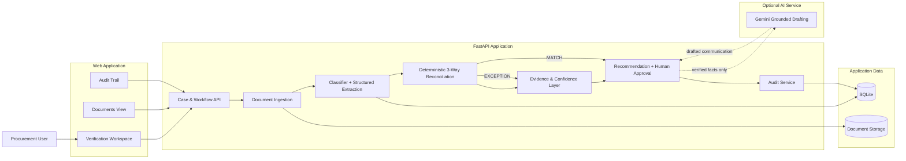

# KaryaFlow AI

**From documents to decisions.**

KaryaFlow AI is an evidence-first procurement operations copilot for small and mid-sized businesses. It turns a Purchase Order, Invoice, and Delivery Challan into a verified three-way match, explains exceptions with source evidence, recommends the next action, and records the human decision in an audit trail.

**Live Demo:** https://karyaflow-ai.onrender.com  
**Repository:** https://github.com/affanSkhan/KaryaFlow-AI

## Why KaryaFlow?

Procurement teams often verify supplier transactions manually across multiple documents. Quantity, pricing, and reference mismatches can be missed, while the reasoning behind a decision is difficult to audit later.

KaryaFlow focuses on one complete operational workflow:

**Documents → Extraction → Reconciliation → Evidence → Recommendation → Human Approval → Audit**

## Core Features

- Purchase Order / Invoice / Delivery Challan ingestion
- Automatic document classification and structured extraction
- Deterministic three-way reconciliation
- Vendor, PO reference, quantity, and unit-price checks
- Field-level evidence with source document, page, snippet, and confidence
- Exception explanation and variance visibility
- Ask Vendor / Escalate recommendations
- Human approval gate before operational actions
- Complete audit timeline
- Optional grounded Gemini drafting with deterministic fallback
- Production-oriented web UI with responsive workflow states

## Architecture



### Critical design decisions

1. **Deterministic business logic.** Quantities, prices, and variance calculations are performed by explicit Python rules. The LLM is not the authority for arithmetic or reconciliation results.
2. **Evidence-first decisions.** Important findings remain linked to their source document, page, snippet, extracted value, and confidence.
3. **Human-in-the-loop control.** KaryaFlow can recommend an action, but a person must explicitly approve it before it is recorded as an operational decision.
4. **Graceful AI dependency.** The core verification workflow remains functional without Gemini. Gemini is optional for grounded communication drafting.
5. **Focused product surface.** The project deliberately solves one procurement workflow end-to-end instead of presenting a generic document chatbot.

## Demo Scenario

The included demo uses a realistic procurement exception:

- Purchase Order: **100 units**
- Invoice: **120 units**
- Delivery Challan: **100 units**

KaryaFlow flags the 20-unit invoice variance, shows evidence from all three documents, recommends **Ask Vendor**, requires human approval, and records the full sequence in the audit trail.

## Run Locally

```bash
python -m venv .venv
# Windows: .venv\\Scripts\\activate
# macOS/Linux: source .venv/bin/activate
pip install -r requirements.txt
uvicorn app.main:app --reload --port 8000
```

Open http://localhost:8000.

For optional Gemini drafting, set `GEMINI_API_KEY`. The main procurement verification flow does not depend on it.

## API

- `GET /api/health`
- `GET /api/ai/status`
- `POST /api/ai/draft`
- `POST /api/cases`
- `POST /api/cases/{case_id}/documents`
- `POST /api/cases/{case_id}/analyze`
- `GET /api/cases/{case_id}`
- `POST /api/cases/{case_id}/actions`
- `POST /api/cases/{case_id}/actions/{action_id}/approve`
- `GET /api/cases/{case_id}/audit`

## Security Notes

- Maximum upload size: 10 MB per file
- MVP accepts PDF/TXT documents
- Uploaded filenames are reduced to their basename before storage
- Secrets are supplied through environment variables and are not committed
- External model calls receive verified facts rather than arbitrary tool instructions
- Business actions require explicit human approval

See [`docs/SECURITY.md`](docs/SECURITY.md) for implementation details.

## Deployment

The application is deployed as a single FastAPI web service on Render.

- `render.yaml` for cloud deployment
- `Dockerfile` for containerized execution
- `docker-compose.yml` for local/container workflows

## License

MIT
