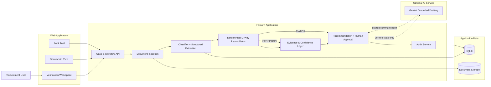
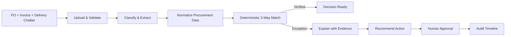

# KaryaFlow AI Architecture

KaryaFlow uses a layered procurement-verification architecture that keeps document intelligence, deterministic reconciliation, AI drafting, human approval, and auditability separate.

## System Architecture

## End-to-End Product Flow

## Design Principles

1. **Deterministic critical logic.** Quantities, prices, and variance calculations are compared by explicit Python rules. The model is never the authority for arithmetic or reconciliation results.
2. **Evidence-first decisions.** Important findings stay linked to source filename, page, snippet, extracted value, and confidence metadata.
3. **Human-in-the-loop control.** KaryaFlow can recommend an action, but a person must explicitly approve it before it becomes an operational decision.
4. **Graceful AI dependency.** The core workflow works without an external model. Gemini is optional for grounded communication drafting.
5. **Focused product surface.** The application solves one procurement workflow end-to-end rather than acting as a generic document chatbot.

## Security Boundaries

- Maximum upload size: 10 MB per file.
- MVP accepts PDF/TXT documents.
- Uploaded filenames are reduced to their basename before storage.
- Business actions require explicit approval.
- External model calls receive verified facts rather than arbitrary tool instructions.
- Secrets are environment variables and are never committed.

## Deployment

The current deployment uses a single FastAPI web service on Render. The same application can be run locally or containerized using the included Docker configuration.
